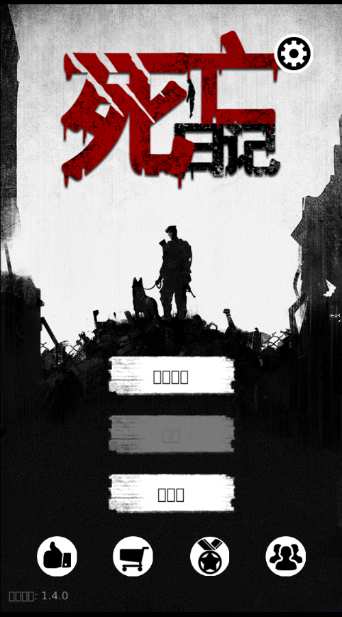

# 死亡日记（Death-Diary）

基于 *Buried Town / Buried-City* 的 Phaser 4 + Bun + TypeScript Web 重制版，设计分辨率为 **640×1136**（`Scale.FIT`）。



## 运行

需要 [Bun](https://bun.sh)。

```bash
bun install
bun run dev
```

开发地址：

- 游戏：`http://localhost:8080`
- API：`http://localhost:3001`
- 健康检查：`http://localhost:8080/api/health`

常用命令：

| 命令 | 说明 |
|------|------|
| `bun run dev` | 同时启动 Web 热更新和 API |
| `bun run build` | 生产构建到 `dist/` |
| `bun run start` | 提供生产静态文件和 API |
| `bun run typecheck` | 检查前后端 TypeScript |
| `bun run test:server` | 运行服务端测试 |
| `bun run gen:frames` | 重新生成图集 JSON 和 `frames.gen.ts` |

游戏存档以 JSON 字符串保存在浏览器 IndexedDB 中，设置面板支持导入和导出。SQLite 仅用于可选云同步。

## 部署

```bash
bun install --frozen-lockfile
mkdir -p data
bun run build
HOST=0.0.0.0 PORT=3000 bun run start
```

访问 `http://服务器IP:3000`，检查服务：

```bash
curl http://127.0.0.1:3000/api/health
```

服务器本地数据：

- SQLite：`data/death-diary.sqlite`
- 初始物资：`data/initial-items.json`

初始物资示例：

```json
{
  "version": 1,
  "storage": {},
  "bag": {}
}
```

文件不存在或无效时，新存档的仓库和背包为空。修改后重启服务生效，也可以通过 `INITIAL_ITEMS_PATH` 指定其他路径。

生产构建会生成 Service Worker，预缓存游戏代码、图片、图集、音频和字体；`/api/**` 不进入静态缓存。离线缓存和云同步需要 HTTPS（localhost 除外）。新 Service Worker 不会强制刷新正在运行的游戏，会在旧页面全部关闭后启用。

建议缓存头：

- `index.html`、`sw.js`、`registerSW.js`：`Cache-Control: no-cache`
- `/assets/*`：`Cache-Control: public, max-age=31536000, immutable`

## 贡献指南

从最新 `main` 创建独立分支，每个分支只处理一个 Issue：

```bash
git switch main
git pull --ff-only
git switch -c feat/issue-N-description
```

提交前执行：

```bash
bun run typecheck
bun run test:server
bun run build
```

开发约定：

- `src/game/scenes/`：Phaser 场景。
- `src/game/systems/`：生存、战斗、制作和地图系统。
- `src/game/data/`：物品、配方、建筑等静态配置。
- `src/game/ui/`：面板、弹窗和通用 UI。
- `server/src/`：API、SQLite 和服务端配置。
- 不手动修改 `src/game/assets/frames.gen.ts` 或 `public/source-art/multiatlas/`，应运行 `bun run gen:frames`。
- 不提交 `data/`、`dist/`、本地数据库或开发环境文件。
- 开发模式不注册 Service Worker，避免缓存干扰 HMR。
- PR 应关联 Issue，说明行为变化并列出实际执行的验证命令。

美术与图集流水线见 [ART.md](./ART.md)，授权以仓库 [LICENSE](./LICENSE) 为准。
